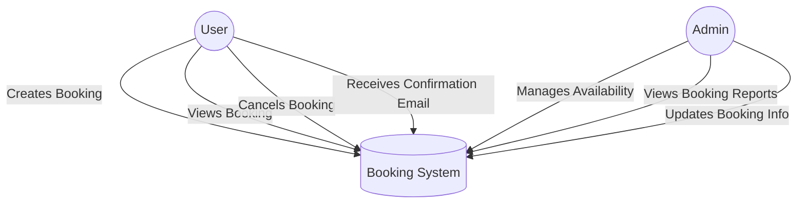

# 📂 Requirement Analysis in Software Development.
This repository serves as a **comprehensive resource** for understanding, documenting, and managing software requirements throughout the development lifecycle. It includes:  
## What is Requirement Analysis?

**Requirement Analysis** is a foundational phase in the Software Development Life Cycle (SDLC) that focuses on identifying, gathering, and analyzing the needs and expectations of stakeholders for a new or modified software system. This process ensures that all stakeholders have a clear, shared understanding of what the software should achieve before the design and development stages begin.

### Purpose of Requirement Analysis

The main goal of requirement analysis is to bridge the gap between the users’ needs and the technical capabilities of the development team. It acts as a blueprint for the system's design, development, and testing. Effective requirement analysis helps to minimize ambiguities, reduce risks, and ensure that the final product meets the intended purpose.

# Why is Requirement Analysis Important?

Requirement analysis plays a vital role in every phase of the SDLC:

1. **Clarity and Alignment**  
   It provides clarity on what the software must do and ensures that developers, testers, and stakeholders are aligned on the expected outcomes.

2. **Risk Reduction**  
   By thoroughly analyzing requirements early in the process, potential issues, conflicts, and technical limitations can be identified and addressed before development begins.

3. **Cost and Time Efficiency**  
   Errors or misunderstandings in requirements often lead to costly rework. Well-defined requirements help streamline development and avoid unnecessary delays.

4. **Quality Assurance**  
   Clearly defined and validated requirements are essential for designing effective test cases, which ensure the software meets the desired quality standards.

5. **Stakeholder Satisfaction**  
   Requirement analysis ensures that the final product meets the users' actual needs, increasing the chances of project success and user satisfaction.

## Key Activities in Requirement Analysis

Requirement Analysis involves several essential activities that ensure software requirements are accurate, complete, and aligned with stakeholder needs. Below are the five key activities involved in this process:

- **Requirement Gathering**  
  This is the initial step where information is collected from stakeholders to understand their needs, expectations, and constraints. It involves studying existing systems, business documents, and regulations that may impact the new software system.

- **Requirement Elicitation**  
  This activity focuses on extracting detailed requirements through direct interaction with stakeholders. Techniques such as interviews, questionnaires, brainstorming sessions, and workshops are commonly used to elicit relevant and specific information.

- **Requirement Documentation**  
  After collecting and eliciting requirements, they are formally recorded in structured formats like the Software Requirements Specification (SRS) document. Good documentation ensures that all requirements are traceable, unambiguous, and accessible to the development and testing teams.

- **Requirement Analysis and Modeling**  
  In this stage, the gathered requirements are analyzed for feasibility, consistency, and completeness. Modeling tools such as data flow diagrams (DFDs), use case diagrams, and entity-relationship diagrams (ERDs) may be used to visualize and validate the logical flow of requirements.

- **Requirement Validation**  
  This step ensures that the documented requirements are correct, aligned with business goals, and approved by stakeholders. Validation techniques include reviews, inspections, and prototyping to verify that the requirements are both complete and feasible.

---

These activities collectively help in minimizing misunderstandings, ensuring stakeholder alignment, and laying a solid foundation for system design and development.

## Types of Requirements

In software engineering, requirements are typically categorized into two main types: **Functional** and **Non-functional Requirements**. Both are essential to ensure that the software system behaves as expected and meets performance and quality standards.

### Functional Requirements

Functional requirements describe what the system should do. They define the specific behaviors, functions, and processes the software must perform to fulfill user and business needs.

**Definition**:  
These are features and operations that the system must support, typically derived from user stories, business rules, and workflows.

**Examples for Booking Management Project**:
- Users must be able to create, view, edit, and cancel bookings.
- The system should send booking confirmation emails to users.
- Admins should be able to manage and update booking availability.
- The system should validate user input such as dates and personal information before processing a booking.
- Registered users can view their booking history through a user dashboard.

### Non-functional Requirements

Non-functional requirements define the quality attributes, constraints, and performance measures of the system. They focus on *how* the system performs its functions rather than *what* it does.

**Definition**:  
These are system-level requirements that define criteria such as performance, scalability, reliability, and usability.

**Examples for Booking Management Project**:
- The system should respond to booking requests within 2 seconds.
- The system must be available 99.9% of the time (high availability).
- User data must be encrypted in transit and at rest (security requirement).
- The interface should be mobile-responsive and accessible to users with disabilities.
- The system must support up to 10,000 concurrent users without performance degradation.

---

Both functional and non-functional requirements are critical for delivering a robust, user-friendly, and dependable booking management system.
## Use Case Diagrams

**Use Case Diagrams** are a type of behavioral diagram defined by UML (Unified Modeling Language) that visually represent the interactions between users (actors) and a system. They help identify the system’s functionalities (use cases) from the end-user’s perspective and are an essential part of requirement analysis.

### Benefits of Use Case Diagrams

- **Clarify system functionality**: They provide a high-level view of what the system is expected to do.
- **Improve communication**: Facilitate discussion among stakeholders, developers, and testers.
- **Identify roles and responsibilities**: Help define who interacts with the system and how.
- **Support requirement validation**: Ensure all functional requirements are accounted for.

### Use Case Diagram for Booking Management System

## Acceptance Criteria

**Acceptance Criteria** are predefined conditions that a software product must meet to be accepted by a user, customer, or other stakeholders. They are written from the perspective of the end-user and define the boundaries and expected behavior of a feature. Acceptance criteria are a key part of requirement analysis as they ensure that all stakeholders have a shared understanding of how a feature should work.

### Importance of Acceptance Criteria in Requirement Analysis

- **Clarifies Requirements**: Translates high-level requirements into detailed, testable conditions.
- **Improves Communication**: Aligns expectations between stakeholders, developers, and QA teams.
- **Ensures Quality**: Provides a basis for writing test cases and conducting user acceptance testing.
- **Supports Agile Development**: Works well with user stories to define “done” for a feature.

### Example: Acceptance Criteria for the Checkout Feature

**Feature**: *Checkout in Booking Management System*

**User Story**:  
*As a user, I want to securely complete my booking using a checkout page so that I can confirm my reservation and receive a receipt.*

**Acceptance Criteria**:
- The user must be able to review the booking details (date, time, price, services) before proceeding.
- The checkout page must allow secure input of payment details (credit/debit card, mobile money).
- The system must validate payment information before processing.
- Upon successful payment, the system should display a confirmation message and send a confirmation email to the user.
- If the payment fails, the system must display an appropriate error message and allow the user to retry.
- The user must be redirected to a confirmation page after a successful transaction.

---

Clearly defined acceptance criteria help ensure that each feature delivers value to the user and meets the expected quality standards before it is marked as complete.

